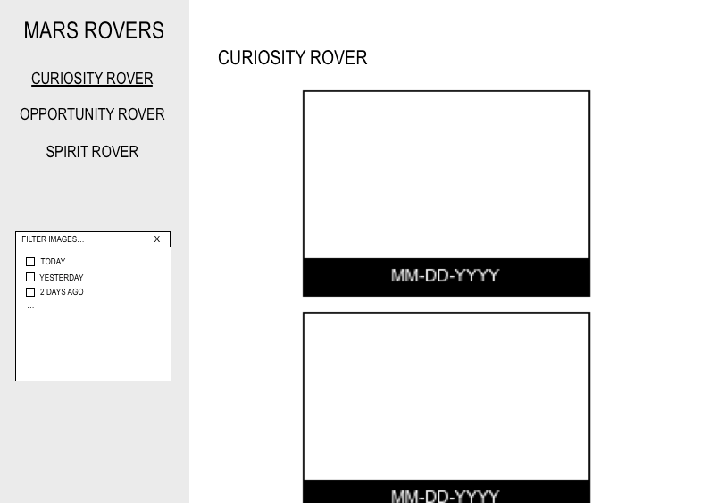

# Mars Rovers Image Browser
This project uses [NASA's Open APIs](https://api.nasa.gov/api.html#MarsPhotos) to create an image browser to load photos from the three different Mars Rovers. The image browser includes a left sidebar to allow navigation between the different rovers and a date filter to view past photos.

When the image browser is loaded, it defaults to photos from the Curiosity Rover for the current date.

## Steps to view project
1. Clone this repository to your local machine
2. Navigate to the project's directory in your terminal
3. Run `ng serve`
4. Navigate to http://localhost:4200 to view the image browser

## Wireframe
 

## TODO
```
* Add JS tests
* Extend filters to include other metadata available from NASA API
* Paginate image results
* Display additional metadata available from NASA API with each image
* Include more detailed styling of images and information
* Add route for "All" images
```

## Resources
```
* AngularJS 4
* Bootstrap
* NASA API
```
